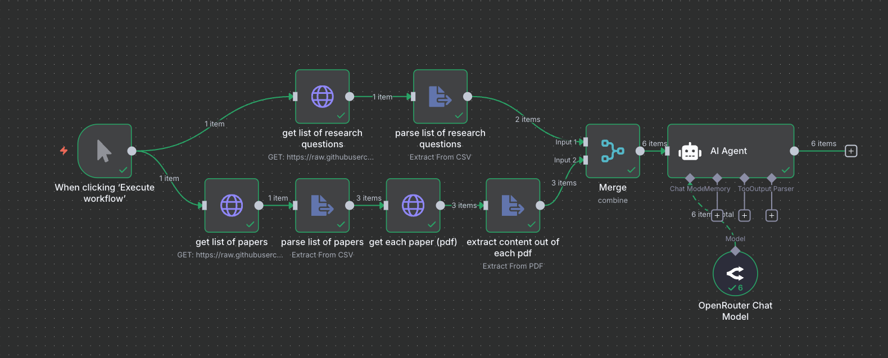

# Automated SLR Answering with n8n

This repository contains the files from the live demo in the `KI in der SLR` on using **n8n** to automate part of a Systematic Literature Review (SLR). The live demo showed how the workflow ingests a list of papers, downloads each PDF, extracts text, and prompts an LLM to answer specific research questions in a compact, tabular format. These instructions help you recreate that experience locally or adapt it to your own corpus.

## Repository layout

| Path | Purpose |
| --- | --- |
| `workflow.json` | Exported n8n workflow (`Manual Trigger ➜ HTTP Requests ➜ File parsers ➜ LLM`). |
| `papers.csv` | Paper metadata and URLs that the workflow fetches. |
| `resources/research-questions.csv` | Research questions that get paired with each paper. |
| `resources/*.pdf` | Sample PDFs used in the demo. |

## Prerequisites

- An n8n instance. Use the [official setup guide](https://docs.n8n.io/hosting/installation/) for your platform.
- Access to an OpenRouter API key (or another LLM provider of your choice). Create a key at [https://openrouter.ai/](https://openrouter.ai/) and store it in n8n credentials.
- Internet access from n8n to download PDFs (or update the workflow to point at local files).

## Getting started

1. **Clone or download this repository**
2. **Launch n8n** following the installation instructions linked above, and open the editor UI.
3. **Import the workflow**: click the menu (three dots) next to “New Workflow” → “Import from File” → choose `workflow.json`.
4. **Configure credentials**:
   - In the “OpenRouter Chat Model” node, create/select credentials that store your OpenRouter API key.
5. **Adjust file sources (optional)**:
   - By default the HTTP Request nodes read from the raw files in this GitHub repository (`papers.csv` and the PDFs). If you fork or host the files somewhere else, update the URLs accordingly.
6. **Execute the workflow** by clicking “Execute Workflow” on the manual trigger. Watch the data cascade through the nodes and inspect the AI Agent output.

## How the workflow is wired

1. `get list of papers` fetches `papers.csv`, and `parse list of papers` turns each row into an item that includes the `pdf_url`, `paper_id`, and `title`.
2. For each paper item, `get each paper (pdf)` downloads the PDF, and `extract content out of each pdf` uses n8n’s file extraction to capture text.
3. In parallel, `get list of research questions` fetches `resources/research-questions.csv`, and `parse list of research questions` produces one item per RQ.
4. `Merge` combines the paper stream with the research question stream, generating every paper/question pair.
5. `AI Agent` (LangChain node) calls the configured OpenRouter model with a tightly scoped prompt to emit JSON answers (`paper_id`, `research_question`, `answers`, `confidence`).

## Customizing the demo

- **Swap in new papers**: add rows to `papers.csv` (hosted wherever your workflow can reach) with new IDs, titles, and `pdf_url`s, or point the HTTP node at a different CSV.
- **Change research questions**: edit `resources/research-questions.csv` and push the updated file to the location referenced in the workflow. The merge node will automatically iterate over the new set.
- **Use a different LLM**: replace the OpenRouter Chat Model with any n8n-supported provider (OpenAI, Azure OpenAI, local inference) and adjust the LangChain agent config accordingly.
- **Persist outputs**: the demo stops at the AI Agent. To capture results, append a node such as “Write Binary File,” “Google Sheets,” or a custom webhook that consumes the JSON emitted by the agent.

Enjoy experimenting with the workflow, remixing the prompt, or embedding it into a larger literature-review automation pipeline!
